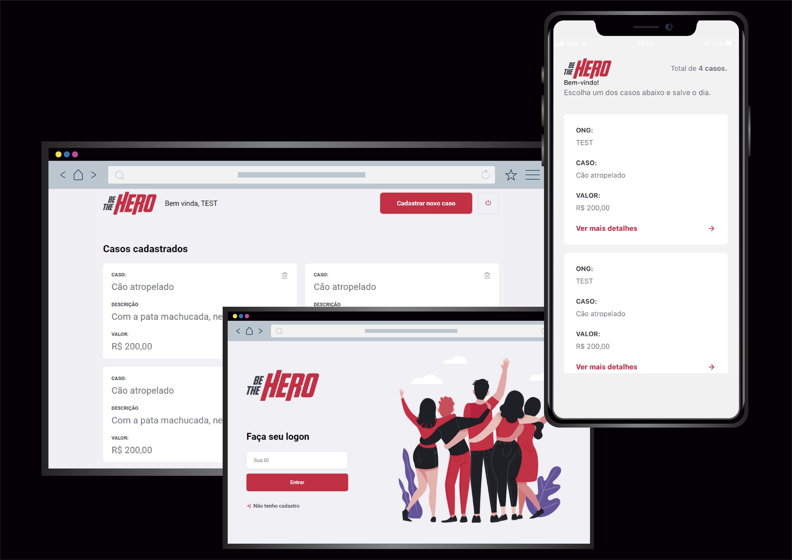

  
  
  

  Aplicação criada durante a Semana OmmiStack da Rocketseat.
  

  
  

# Desenvolvimento

### Funcionalidades 

  - Criação de ONGs.
  - Criar e deletar casos.
  - Login da ONG por ID.
  - Listagem de casos.
  - Envio de mensagem para contato com a ONG por e-mail e WhatsApp.

### Backend 

  - Linguagem e Framework: NodeJS e ExpressJS.
  - Banco de dados: SQlite.
  - Query Builder: Knex.

### Frontend

  - Linguagem: ReactJS.
  
### Mobile

  - Linguagem: React Native.

### Tests
  - Teste de rotas no backend: Insomnia.
  - Testes integrados: Jest e Supertest.
